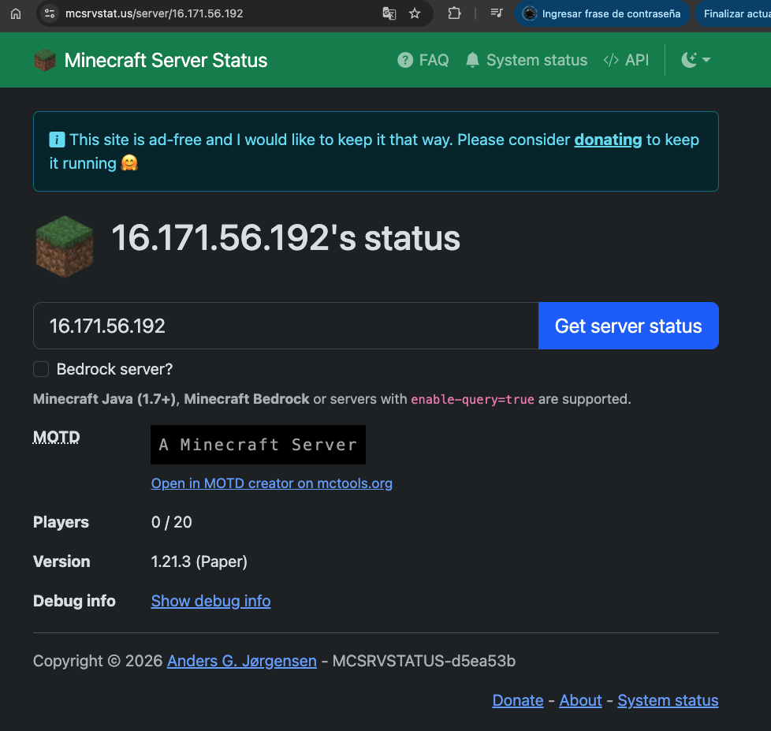

# AWS Serverless Minecraft Infrastructure

This project deploys a high-performance **Minecraft: Java Edition** server on **AWS Fargate** using **Terraform**. It features a fully serverless architecture with persistent world storage via **Amazon EFS**.

## 🚀 Project Overview

The goal of this project was to host a persistent gaming environment without managing traditional EC2 instances. By using ECS Fargate, the infrastructure is 100% serverless, meaning the server only consumes resources when active, making it cost-effective and easy to scale.

### Key Features
* **Serverless Execution:** Powered by AWS Fargate (No OS patching or EC2 management).
* **World Persistence:** Amazon EFS integration ensures game maps and player data are saved permanently.
* **Optimized Networking:** Custom VPC with security rules optimized for the Minecraft protocol (Port 25565).
* **Infrastructure as Code:** 100% automated provisioning with Terraform.

## 🏗 Architecture Diagram


1.  **ECS Fargate:** Executes the Minecraft Docker container (1vCPU / 2GB RAM).
2.  **Amazon EFS:** Provides a scalable file system mounted to the container's data directory.
3.  **CloudWatch Logs:** Real-time logging for server monitoring and troubleshooting.
4.  **VPC:** Public subnets with an Internet Gateway for global reachability.

## 📸 Deployment Proof

The server status is verified to confirm the infrastructure is reachable and the service is healthy:



---

## 🛠 Deployment Instructions

### Prerequisites
* Terraform installed.
* AWS CLI configured.

### Steps
1.  **Initialize & Plan:**
    ```bash
    terraform init && terraform plan
    ```
2.  **Apply Configuration:**
    ```bash
    terraform apply -auto-approve
    ```
3.  **Connect:**
    Retrieve the Task Public IP from the AWS Console and join via Minecraft Java Edition.

## 📝 Lessons Learned
* **Container Storage:** Mastered the mounting of EFS volumes into ECS tasks to solve the "stateless" nature of containers.
* **Fargate Performance:** Fine-tuned CPU and Memory allocation to balance server stability with AWS costs.
* **Security Hardening:** Implemented "Least Privilege" security groups, exposing only the necessary game port.

---
*This project is a modified fork of the original work by Antoine CICHOWICZ, customized for a professional AWS Cloud Portfolio.*
