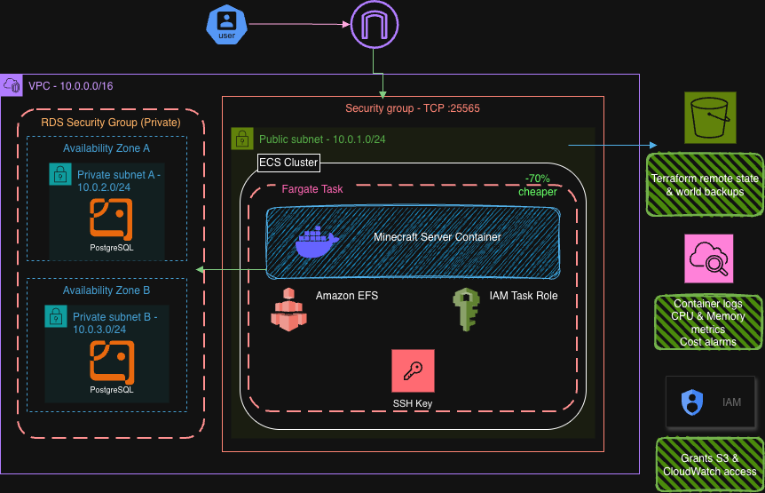

# AWS Serverless Minecraft Infrastructure


This project deploys a **Minecraft: Java Edition** server on **AWS ECS Fargate** using **Terraform**, with a fully automated CI/CD pipeline via **GitHub Actions**.

---

## 🏗️ Architecture




| Component | Technology |
|-----------|-----------|
| Compute | AWS ECS Fargate SPOT (1vCPU / 2GB RAM) |
| Storage | Amazon EFS (persistent world data) |
| Networking | Custom VPC, public subnets, Internet Gateway, Security Group |
| Logging | Amazon CloudWatch Logs |
| IaC | Terraform |
| CI/CD | GitHub Actions |

---

## 💡 Technical Decisions

### Why Fargate SPOT instead of EC2 or Fargate on-demand?

A standard EC2 instance requires managing OS updates, SSH hardening, and manual scaling. Fargate eliminates that overhead entirely — no servers to patch, no AMIs to maintain.

Within Fargate, I chose **SPOT capacity** specifically because a Minecraft server is an interruptible workload: players can reconnect in seconds if a task gets replaced, and the world data is safe on EFS regardless. This makes it a perfect fit for SPOT, which uses AWS's spare compute capacity at a steep discount.

| Option | Cost/month (24/7) | Notes |
|--------|------------------|-------|
| EC2 t3.small on-demand | ~$16 | Server management overhead |
| Fargate on-demand | ~$44 | No management, but expensive |
| **Fargate SPOT** ✅ | **~$13** | **~70% cheaper than on-demand** |

### Why EFS instead of EBS?

EBS volumes are tied to a single Availability Zone. If Fargate replaces the task in a different AZ (which it does freely with SPOT), the EBS volume wouldn't be accessible — you'd lose the world.

**EFS is a network file system**: it's accessible from any AZ, mounts automatically into the new Fargate task, and the Minecraft world survives every restart or task replacement transparently. It's the only storage option that works correctly with stateless Fargate containers across AZs.

### Why a custom VPC instead of the default?

The default AWS VPC has broad network permissions that don't follow least-privilege principles. A custom VPC lets me define exactly which subnets exist, control routing explicitly, and isolate resources cleanly — which matters for any production-grade infrastructure.

### Why pinned versions everywhere?

The provider, the VPC module, and the container image are all pinned to explicit versions. Infrastructure as Code is only reproducible if the same code produces the same result next month — an unpinned `latest` image silently changes the Minecraft version under you.

---

## 💰 Cost Breakdown

> Estimated for `eu-north-1` (Stockholm), server running 24/7. Costs scale down significantly if you stop the task when not in use.

| Service | Usage | Monthly Cost |
|---------|-------|-------------|
| ECS Fargate SPOT | 1 vCPU + 2GB RAM, 730h | ~$13.07 |
| Amazon EFS | ~2 GB world data | ~$0.64 |
| CloudWatch Logs | Low volume | ~$0.12 |
| VPC / Networking | Data transfer | ~$0.60 |
| **Total** | | **~$14.43/month** |

**vs Fargate on-demand:** ~$43.53/month → **~70% savings with SPOT**

> 💡 Tip: Stop the ECS task when the server isn't in use. At ~$0.018/hour, running it only 4h/day reduces the compute cost to ~$2.20/month.

---

## 🔄 CI/CD Pipeline

```
Push / Pull Request                Manual trigger (Actions tab)
        ↓                                      ↓
✅ terraform fmt                      ⏸️  production environment
✅ terraform init -backend=false          approval gate
✅ terraform validate                          ↓
                                      ✅ terraform plan
   (no AWS credentials needed)        🚀 terraform apply
```

**Validation** runs on every push and pull request. It needs no AWS credentials, so the pipeline verifies the code without ever touching live infrastructure.

**Deployment** is triggered manually via `workflow_dispatch` and passes through the `production` environment approval gate before applying. AWS credentials are stored as **GitHub Secrets** — never hardcoded.

---

## 🚀 Deployment Instructions

### Prerequisites

- [Terraform](https://developer.hashicorp.com/terraform/install) >= 1.7 installed
- [AWS CLI](https://aws.amazon.com/cli/) configured with a profile that has ECS, EFS, VPC, and IAM permissions

### 1. Clone

```bash
git clone https://github.com/MisaelTox/minecraft-server-aws-ecs-fargate.git
cd minecraft-server-aws-ecs-fargate
```

### 2. Configure (optional)

All variables have sensible defaults. To override them, create a `terraform.tfvars` file:

```hcl
region            = "eu-north-1"   # AWS region
minecraft_version = "1.21.3"       # Minecraft server version
cpu               = "1024"         # Fargate CPU units (1024 = 1 vCPU)
memory            = "2048"         # Fargate memory in MB
```

> Terraform state is stored locally in this project. For team use, add a `backend "s3"` block to enable remote state.

### 3. Initialize and deploy

```bash
terraform init     # download providers and the VPC module
terraform plan     # preview what AWS resources will be created
terraform apply    # deploy (~3–5 minutes)
```

### 4. Connect to the server

Once the ECS service reports **Running**, get the task's public IP:

```bash
aws ecs list-tasks --cluster minecraft_cluster
aws ecs describe-tasks --cluster minecraft_cluster --tasks <TASK_ARN>
```

Then open Minecraft Java Edition → Multiplayer → Add Server → paste the IP with port `25565`.

### 5. Tear down

```bash
terraform destroy  # removes all AWS resources and stops billing
```

> ⚠️ **This deletes the EFS volume and your Minecraft world with it.** Back up `/data` before destroying if you want to keep your world. To pause billing without losing anything, scale the service to zero instead:
>
> ```bash
> aws ecs update-service --cluster minecraft_cluster --service minecraft_service --desired-count 0
> ```

---

## 📝 Lessons Learned

- **CI/CD with GitHub Actions** — separating credential-free validation (every push) from gated manual deploys keeps the pipeline honest without exposing AWS keys to routine commits
- **Stateful containers** — mounting EFS into Fargate tasks solves the classic stateless container problem without sacrificing portability across AZs
- **Cost optimization** — matching workload interruptibility (Minecraft) to the right pricing model (SPOT) achieves ~70% savings with no impact on the player experience
- **Security hardening** — least-privilege Security Group (only TCP :25565 inbound, NFS restricted to the SG itself), an execution role limited to the AWS-managed ECS policy, and no task role at all since the container calls no AWS APIs

---

*Fork of the original work by [Antoine CICHOWICZ](https://github.com/czantoine), extended with CI/CD automation, cost analysis, and architectural documentation.*
